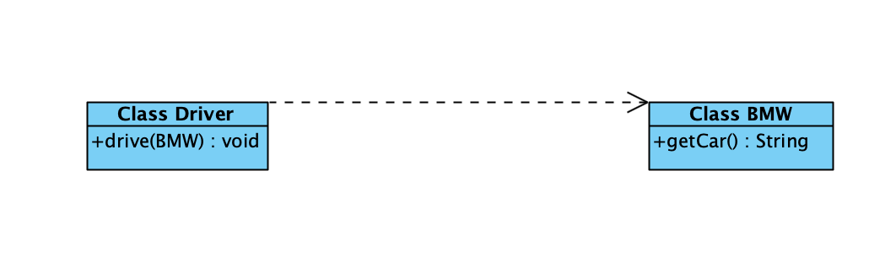
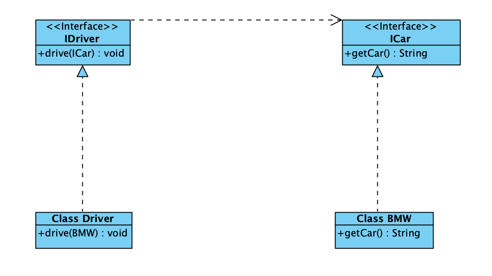

# 设计原则之依赖倒置原则

### 基本介绍

- 高层模块不能依赖低层模块，二者都应该依赖其抽象
- 抽象不应该依赖细节，细节应该依赖抽象
- 依赖倒置的中心思想是面向接口编程
- 依赖倒置原则是基于这样的理念：相对于细节的多变性，抽象的东西要稳定的多。以抽象为基础搭建的架构要比细节为基础搭建的架构稳定的多。在java中，抽象指的是抽象类和接口，细节就是指具体的实现类。
- 使用抽象类或接口的目的是制定好规范，而不涉及任何具体的操作，把展现细节的任务交给他们的实现类去完成。

### 类图



### 代码示例

```java
package demo.dependecy;

public class Driver {

    public void drive(BMW bmw){
        System.out.println("张三开着" + bmw.bmwCar());
    }


    public static void main(String[] args) {

        Driver driver = new Driver();
        driver.drive(new BMW());
    }

}

class BMW{

    public String bmwCar(){
        return "宝马汽车";
    }

}
```

### 代码分析

BMW类（宝马车类）中的方法bmwCar，返回宝马汽车。在Driver类中依赖BMW类，控制台打印出"张三开着宝马汽车。" 单纯的看没什么问题。进行下一步分析，人能开汽车，不光能开宝马汽车，还能开其他汽车才行。假如现在又新增了一辆奔驰汽车。需要让张三来驾驶，那么Driver类需要修改，需要增加一个驾驶奔驰车的方法。这不符合抽象高层，这属于依赖低层。或者哪天司机换成李四了。又该如何！

### 类图修改



### 代码修改

```java
package demo.dependecy;

public class Driver implements IDriver{

    private String name;

    public Driver(String name) {
        this.name = name;
    }

    @Override
    public void drive(ICar car) {
        System.out.println(this.name +"驾驶着"  +car.getCar());
    }

    public static void main(String[] args) {

        IDriver zhangsan = new Driver("张三");
        zhangsan.drive(new BMW());

        IDriver lisi = new Driver("李四");
        lisi.drive(new Benz());
    }

}


interface IDriver{

    public void drive(ICar car);
}

interface ICar{
    public String getCar();
}


class BMW implements ICar{

    @Override
    public String getCar() {
        return "宝马汽车";
    }
}

class Benz implements ICar{
    @Override
    public String getCar() {
        return "奔驰汽车";
    }
}
```

### 代码分析

司机类抽象成IDriver接口，增加驾驶drive方法。宝马类抽象成ICar接口，增加汽车类型getCar方法。IDriver接口依赖ICar接口。即高层依赖高层，抽象依赖抽象。

Driver类实现IDriver接口，增加name属性用于存储驾驶人姓名。当创建驾驶人员时，只需要给Driver的name属性赋值即可。当新增宝马车时，创建一个宝马类实现ICar接口即可。

Driver和BMW类各自实现各自的接口，两者之间没有联系。

### 总结

1. 依赖倒置原则，低层模块尽量有抽象类或接口。或者两者都有，程序稳定性更好。
2. 变量的声明类型尽量是抽象类或者接口。
3. 继承时遵守里式替换原则。
4. 高层不依赖低层，抽象不依赖具体。具体实现细节之间没有联系。
5. 依赖倒置原则的主要思想是面对接口编程。
