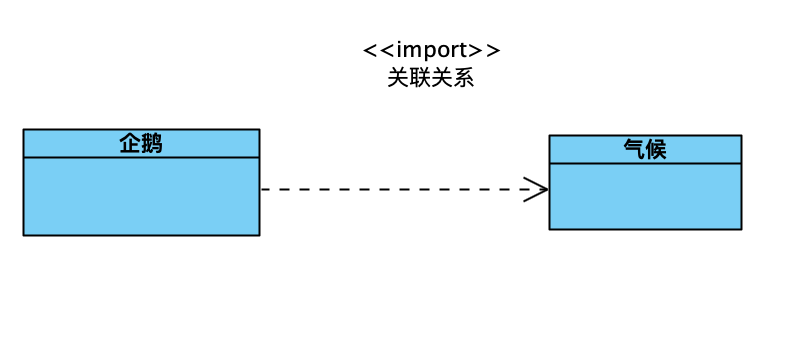

# 类与类关系及表示方式

### 1、依赖关系

举个例子，氧气、水与人的关系就是依赖关系。人依赖氧气和水。图表示如下：

依赖关系使用箭头+虚线表示。

### 2、泛化关系

泛化又叫继承关系，指一个类继承另一个类。

泛化使用空心三角箭头+实线来表示。

### 3、实现关系

实现就是指，一个类实现了一个接口。

实现用实心三角形箭头+虚线表示。

### 4、组合关系

组合关系是指，一个类中必须得存在另一个类。

组合关系使用实心菱形+实线+箭头，这里的工具画出的缺少了箭头。还可以表示关系，一只鸟，有两个翅膀。

### 5、聚合关系

聚合关系是指整体与部分的关系。比如一个大雁群与一只大雁的关系。就是聚合关系。

聚合关系的表示方式为空心菱形+实线+箭头的方式。这里的工具画出的缺少了箭头。

### 6、关联关系

关联关系是指一个类的成员变量是另一个类。

关联关系使用实线+箭头的方式来表示。此处的工具没有实线。