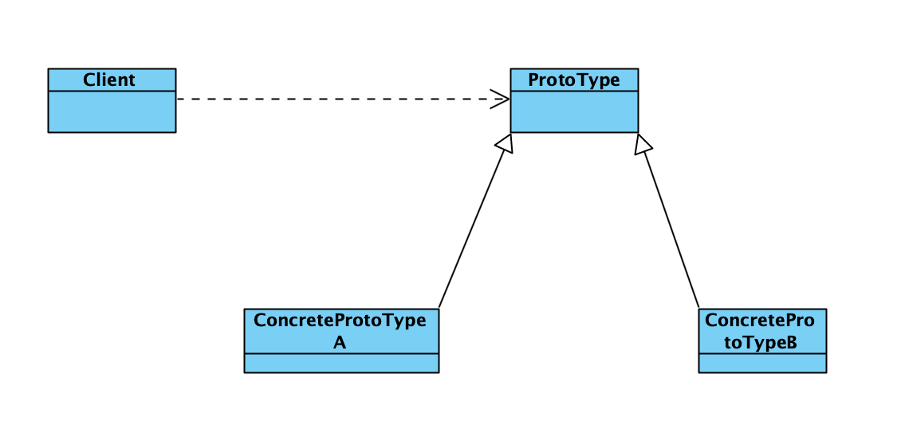

# 设计模式之原型模式

### 基本介绍

- 创建新的对象比较复杂时，可以利用原型模式简化创建对象的过程。同时也能够提高效率
- 不用重新初始化对象，而是在运行时获取对象的状态。
- 在实现深克隆的时候，需要实现复杂的代码。
- 缺点：需要为每一个类配备一个克隆方法，这对全新的类来说不是很难。但是对已有的类需要进行改造，这违背了ocp原则。

### 类图

Spring中在实例化Bean对象时，有一步是判断，是否是原型类

